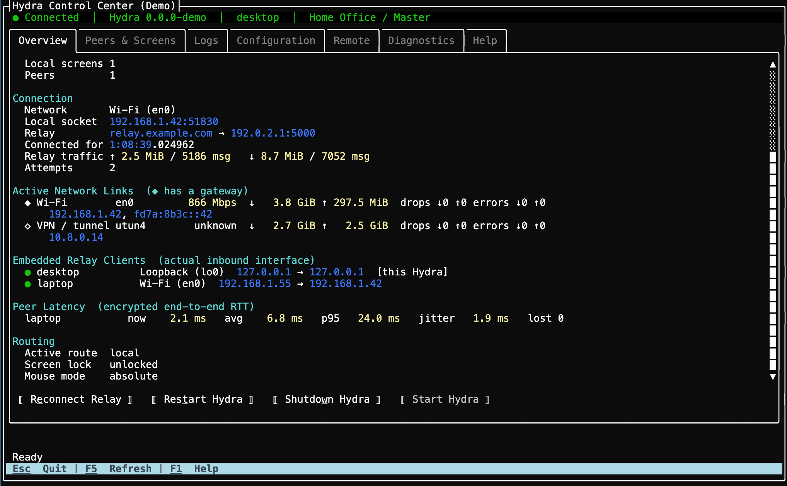
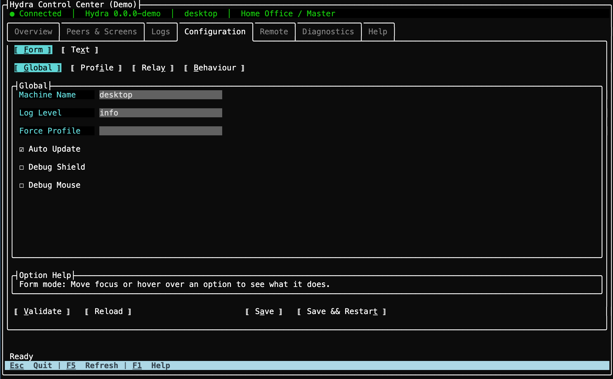

# Hydra

**A modern, cross-platform software KVM** — share one keyboard and mouse across Mac, Windows, and Linux by moving the cursor to the edge of the screen. A spiritual successor to Synergy and Barrier: end-to-end encrypted, works across networks and VPNs through an optional relay, and types correctly across keyboard layouts.

[](LICENSE)
[](https://github.com/PacAnimal/hydra/releases/latest)
[](https://github.com/PacAnimal/hydra/releases)
[](https://github.com/PacAnimal/hydra/actions/workflows/build-hydra.yml)


---

## Why Hydra?

| Feature | Hydra | Synergy 3 | Deskflow | Input Leap | Barrier |
|---|---|---|---|---|---|
| Open source | ✅ GPLv2 | ❌ commercial ($29–39) | ✅ GPLv2 | ✅ GPLv2 | ✅ GPLv2 |
| macOS / Windows / Linux | ✅ | ✅ | ✅ | ✅ | ✅ |
| **Works across networks / NAT (encrypted relay)** | ✅ | ❌ LAN only | ❌ | ❌ | ❌ |
| **Network-aware profile switching** | ✅ | ❌ | ❌ | ❌ | ❌ |
| **Cross-layout keyboard (types 'å' correctly on a US slave)** | ✅ | ❌ | ❌ | ❌ | ❌ |
| **Headless Linux / Raspberry Pi forwarder (no display server)** | ✅ | ❌ | ❌ | ❌ | ❌ |
| Cross-machine file transfer | ✅ macOS + Windows | ✅ Windows + macOS | ❌ | ❌ | ❌ |
| Clipboard sync (text + images) | ✅ | ✅ | ✅ | partial | partial |
| Active development (2026) | ✅ | ✅ | ✅ | partial | ❌ |

---

## In practice

**Commuting laptop.** Dock at the office and Hydra switches to your Office profile — cursor flows between screens, files copy across with one hotkey. Unplug, get home, join the home WiFi: Hydra switches to Home, where the same laptop now drives a mini-PC on the TV. No network at a coffee shop — Hydra just idles.

**Headless Pi as a wireless keyboard.** Run Hydra in remote-only mode on a Pi behind the TV. Plug in any USB keyboard and mouse and they control your Mac across the room — no display server, no Xorg, just evdev and a network cable.

**Cross-layout typing.** Norwegian master, US slave — type `å` and `å` arrives on the slave, even though its keyboard has no such key. Hydra resolves characters to Unicode on the master before sending; dead keys (`' + a` → `á`) work the same way.

**Shared office screen.** A wall display runs as a slave. Whoever slides their cursor onto it first takes control — no cables, no HDMI switches, no "can you share your screen?"

**Cross-network via relay.** Your work laptop is on the VPN and can't see your personal machine on the same LAN. Drop a Styx container on a cheap VPS, paste the relay config into both `hydra.conf` files, and they connect through it — end-to-end encrypted, no port forwarding.

---

## Install

Run the binary directly to try Hydra out, or use `--install` to set it up as a service / LaunchAgent that auto-starts on login and survives reboots.

**macOS (Apple Silicon):**
```bash
curl -L https://github.com/PacAnimal/hydra/releases/latest/download/hydra-osx-arm64.tar.gz | tar xz
./hydra             # run directly — good for testing, no install needed
./hydra --install   # installs as a login item, auto-starts on login
```
`--install` registers a LaunchAgent, clears the quarantine flag, and starts Hydra immediately. Grant Accessibility permission when prompted: System Settings → Privacy & Security → Accessibility → enable Hydra. To remove: `./hydra --uninstall`.

Run `--install` *before* granting Accessibility — macOS ties the permission to the binary's identity at the moment you grant it, so granting first means removing and re-adding Hydra from the Accessibility list afterward.

**Windows (x64):**

Download [hydra-win-x64.zip](https://github.com/PacAnimal/hydra/releases/latest/download/hydra-win-x64.zip), extract, then run:
```
hydra.exe             # run directly — good for testing, no install needed
hydra.exe --install   # install as a Windows service (auto-start, survives logout)
```
A UAC prompt will appear for `--install`. Because Hydra installs as a `LocalSystem` service, it stays active on the Windows login and lock screens — mouse and keyboard control works even before you sign in. To remove: `hydra.exe --uninstall`.

**Linux (x64):**
```bash
curl -L https://github.com/PacAnimal/hydra/releases/latest/download/hydra-linux-x64.tar.gz | tar xz
chmod +x hydra
./hydra
```

**Linux (arm64 / Raspberry Pi):**
```bash
curl -L https://github.com/PacAnimal/hydra/releases/latest/download/hydra-linux-arm64.tar.gz | tar xz
chmod +x hydra
./hydra
```

All releases are [self-contained](https://github.com/PacAnimal/hydra/releases) — no .NET runtime installation required.

> **Priority:** Hydra runs above normal process priority so a busy machine doesn't stutter the cursor.
> `--install` handles this automatically on macOS and Windows; on Linux, add `Nice=-10` to your systemd unit.

> **Linux with display:** Requires X11 with XInput2. Wayland is not yet supported.

> **Linux headless (no display):** See [Remote-only / Raspberry Pi setup](docs/CONFIGURATION.md#headless-linux-no-display-server).

### Terminal control center

Open Hydra's local cross-platform TUI in another terminal:

```bash
./hydra tui
./hydra tui --config /path/to/hydra.conf
./hydra tui --color   # tint the connection line green/red by actual state
```



Process, profile, relay, peers, network interfaces, and live traffic at a glance — reconnect or restart with one keypress.



Edit `hydra.conf` from a sectioned form or the raw JSON. Pair and manage a remote peer over the encrypted relay from the same screen.

Closing the TUI does not stop Hydra — `Esc` just quits the TUI.

---

## Quickstart

Create `hydra.conf` next to the binary on **each machine**.

**Master** (the machine with the physical keyboard and mouse):

```json
{
  "name": "desktop",
  "profiles": [{
    "mode": "Master",
    "embeddedStyxServer": { "port": 5000, "password": "secret" },
    "hosts": [
      { "name": "desktop", "neighbours": [{ "direction": "right", "name": "laptop" }] },
      { "name": "laptop" }
    ]
  }]
}
```

**Slave** (the machine that receives input):

```json
{
  "name": "laptop",
  "profiles": [{
    "mode": "Slave",
    "embeddedStyx": { "server": "http://192.168.1.10:5000", "password": "secret" }
  }]
}
```

Replace `192.168.1.10` with the master's IP address. Run `./hydra` on both machines. Move the cursor past the right edge of the master's screen — it appears on the slave.

### Hotkeys

All hotkeys use **Ctrl+Alt+Super** (Super = ⌘ on macOS, Win key on Windows):

| Hotkey | Action |
|--------|--------|
| `Ctrl+Alt+Super+L` | Toggle cursor lock — pin to current screen, or release to roam freely |
| `Ctrl+Alt+Super+M` | Toggle relative mouse mode on the current remote screen (useful for games) |
| `Ctrl+Alt+Super+C` | Copy selected files/folders to Hydra's cross-machine clipboard (macOS, Windows) |
| `Ctrl+Alt+Super+V` | Paste previously copied files to the current machine |

For cross-network setups (different LANs or over a VPN), see [Networking with Styx](docs/CONFIGURATION.md#networking-with-styx).

---

## Config editor

The easiest way to set up multi-machine layouts, Styx relay configs, and network-aware profiles is the **[Hydra Config Editor](https://hydra-config.c-net.org/)** — a web UI that lets you visually arrange screens and download a ready-to-use `hydra.conf`.

---

## Features

- Seamless cursor transitions in any direction (left, right, up, down)
- **Multi-monitor support** — multiple local and remote monitors, auto-detected at startup and on connect/disconnect
- Flexible layout: L-shaped, grids, or any topology
- **Range-based neighbours** — split edges to route to different hosts by cursor position
- **Per-screen scale** — control cursor speed on each remote screen
- Full keyboard forwarding including dead keys and special characters — resolved on the master using its keyboard layout
- Mouse button and scroll forwarding
- **Clipboard sync** — text and images synced automatically when switching machines (all platforms)
- **File transfer** — cross-machine copy/paste of files and folders via hotkey (macOS and Windows)
- **Media key forwarding** — volume, playback, brightness keys forwarded to the active machine
- **Screensaver sync** — activating the screensaver on the master locks all connected slaves
- **Windows login screen support** — installed as a system service, Hydra stays active on the lock and login screens
- End-to-end encrypted relay via **Styx** for machines on different networks
- **Multiple masters per slave** — several machines can share a single slave display; whoever moves their cursor onto it takes control
- **Remote-only mode** — use a headless Linux machine (e.g. Raspberry Pi) as a dedicated input forwarder with no local screen
- **Terminal control center** — monitor, control, and configure the local Hydra instance from macOS, Windows, Linux, or SSH

---

## Full documentation

- [Configuration reference](docs/CONFIGURATION.md) — all config fields, screen layout options, network-aware profiles, hotkeys, Styx setup, and building from source
- [TUI architecture](docs/TUI_ARCHITECTURE.md) — management boundaries, security invariants, platform lifecycle behavior, and validation expectations
- [TUI hotkeys](docs/HOTKEYS.md) — every keyboard shortcut in the terminal control center, tab by tab
- [Styx protocol](Styx.md) — the relay's wire protocol, for implementing your own client or server against it
